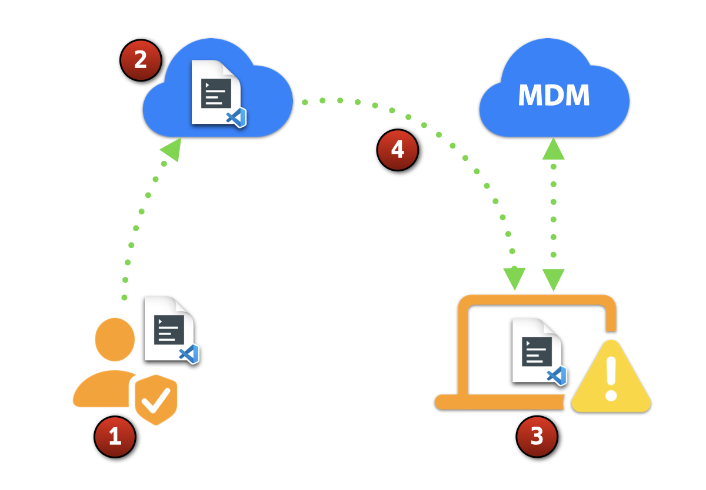

# [EDR Script Runner (0.0.5)](https://snelson.us/)

> A proof-of-concept workflow for securely executing a repository-hosted script

## Background

While EDR tools can excel at running one-off code on a limited number of endpoints, device management solutions are often best suited for executing predefinded policies at-scale.

**EDR Script Runner** strives to strike a balance between the immediate, dynamic needs of threat hunting teams and the reliabiity of a MDM server, by securing executing a repository-hosted script, only when necessary.

## Workflow

1. An authorized administrator edits [`edrScript.zsh`](edrScript.zsh), generates its hash as [`edrScriptHash.txt`](edrScriptHash.txt), then commits and pushes to a secure repository
    - `openssl dgst -sha256 "edrScript.zsh" | awk -F'= ' '{print $2}' > edrScriptHash.txt`
1. The script and its hash await client-side execution
1. The MDM server instructs the client to execute [`edrScriptRunner.zsh`](edrScriptRunner.zsh), which first validates the checksum (provided via [`edrScriptHash.txt`](edrScriptHash.txt) or via a Jamf Pro Script Parameter)
1. The script's `scriptModificationTimestamp` variable is compared against the last client-side execution; if different, the script is executed

---

## Implementation

1. Blah
1. Blah, blah
1. Blah, blah, blah

---

### Scripts
- [`edrScriptRunner.zsh`](edrScriptRunner.zsh)
- [`edrScript.zsh`](edrScript.zsh)
- [`edrScriptHash.txt`](edrScriptHash.txt)