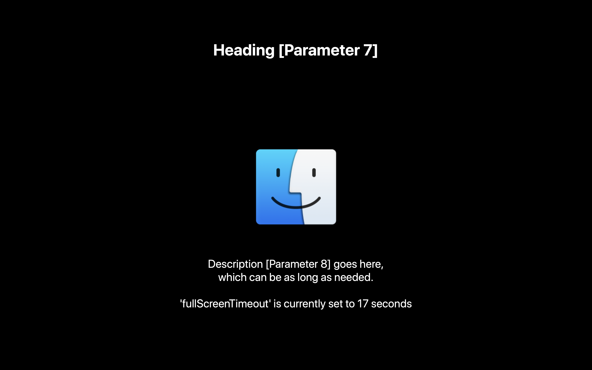
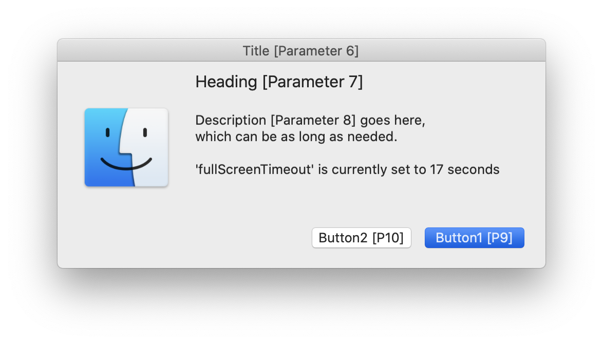
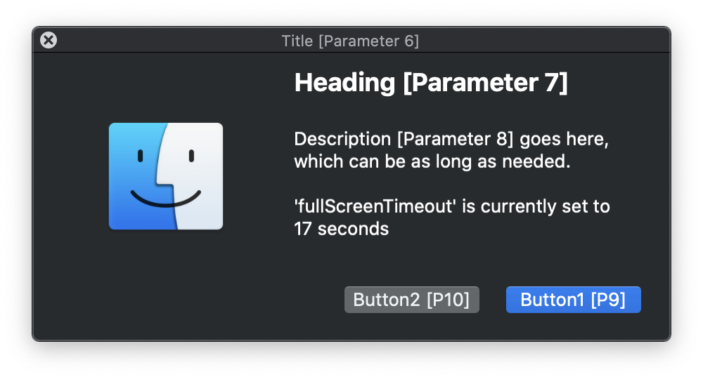

# Actionable messages with Jamf Helper

> When `swiftDialog` just isn't an option, leverage Jamf Helper to provide your users actionable messages

## Background

With only double-digit stragglers still running macOS Catalina, a fresh deployment of Nudge-Python seemed overkill, so we turned to an old friend `jamfHelper` and added some new racing stripes.

|  |  |
|---|---|

[Continue reading …](https://snelson.us/2023/01/jamf-helper)

## Script
- [Actionable messages with Jamf Helper.bash](Display%20Message%20with%20Jamf%20Helper.bash)
