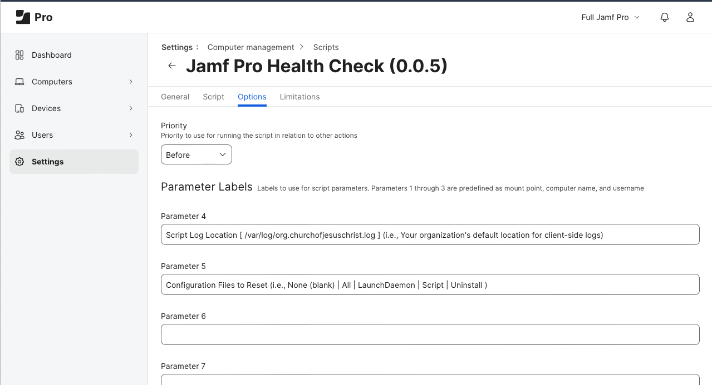

<!-- markdownlint-disable-next-line first-line-heading no-inline-html -->

  
# [Jamf Pro Health Check (0.0.5)](https://snelson.us/jphc)
 

## Overview

1. This script creates a client-side LaunchDaemon which marks the Mac as "unhealthy" each morning shortly after midnight.
1. Adding this script to your Jamf Pro daily inventory update policy will mark the Mac as "healthy" each time the policy is executed successfully.
1. Leverage a [vendor's ability to read client-side `.plist` values](https://docs.paloaltonetworks.com/globalprotect/10-1/globalprotect-admin/host-information/configure-hip-based-policy-enforcement) to determine if the Mac is "healthy" or "unhealthy", based on the Mac's ability to update its inventory with the Jamf Pro server.

---

## Assumptions

- Presumes you'll be leveraging [Palo Alto Networks GlobalProtect HIP-Based Policy Enforcement](https://docs.paloaltonetworks.com/globalprotect/10-1/globalprotect-admin/host-information/configure-hip-based-policy-enforcement) to read the value of `${key}` from `${plistFilepath}`.

---

## Implementation

1. Review and adjust the `Organization Variables` to fit your organization
1. Test locally (in an elevated Terminal session), replacing the following variable names with the actual values from your customized script:
    - Check the value of the client-side `.plist`
        - `defaults read ${plistFilepath} "${key}"`
    - Set Configuration Files to Reset — `resetConfiguration` — to the desired option during testing
        - None (blank)
        - `All`
        - `LaunchDaemon`
        - `Script`
        - `Uninstall`
1. Upload the [Jamf-Pro-Health-Check-EA.zsh](Jamf-Pro-Health-Check-EA.zsh) Extension Attribute to your Jamf Pro server
1. Upload the [Jamf-Pro-Health-Check.zsh](Jamf-Pro-Health-Check.zsh) script to your Jamf Pro server, using the following Script Parameter Labels:
    - **Parameter 4:** `Script Log Location [ /var/log/org.churchofjesuschrist.log ] (i.e., Your organization's default location for client-side logs)`
    - **Parameter 5:** `Configuration Files to Reset (i.e., None (blank) | All | LaunchDaemon | Script | Uninstall )`
    
1. Add the script to your inventory-related policies:
    - Daily inventory update
    - Self Service inventory update

---

### Scripts
- [Jamf-Pro-Health-Check.zsh](Jamf-Pro-Health-Check.zsh)
- [Jamf-Pro-Health-Check-EA.zsh](Jamf-Pro-Health-Check-EA.zsh)