# Presentation Mode

 Self Service Policy")

## Help your users have successful presentations with a Self Service policy which temporarily extends screensaver password timeouts, computer sleep options and automatic policy executions, then automatically restores approved security settings after a configurable duration

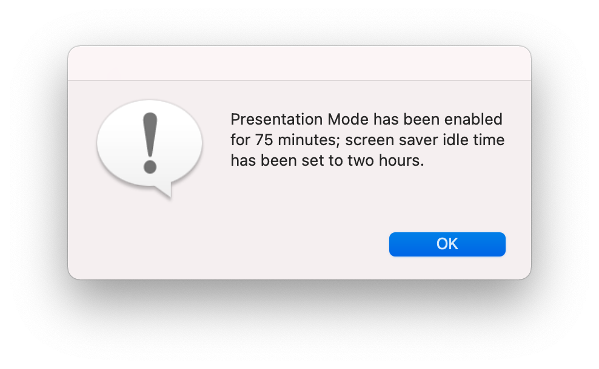


---

# Contents
- [Genesis](#genesis)
- [Overview](#overview)
- [Setup and Configuration](#setup-and-configuration)
	- [API Permissions for Computer Extension Attributes](#api-permissions-for-computer-extension-attributes)
	- [Extension Attribute](#extension-attribute)
	- [Smart Groups](#smart-groups)
	- [Configuration Profiles](#configuration-profiles)
	- [Scripts](#scripts)
		- [Delayed Policy Trigger Create](#delayed-policy-trigger-create)
		- [Delayed Policy Trigger Disable](#delayed-policy-trigger-disable)
		- [Display Message: JAMF binary](#display-message-jamf-binary)
		- [Extension Attribute Update](#extension-attribute-update)
	- [Policies](#policies)
		- [Policies Overview](#policies-overview)
		- [Presentation Mode Enable](#presentation-mode-enable)
		- [Presentation Mode Disable](#presentation-mode-disable)
- [Automatic Policy Execution Scope](#automatic-policy-execution-scope)
- [End Notes](#end-notes)
	- [Rehearsals](#rehearsals)

---

# Genesis

Some time ago, one of our C-level leaders — who wisely prefers macOS — was presenting to a group of other C-level leaders (most of whom use a _different_ operating system).

The PDF-only presentation was going well and a particular page sparked a discussion; a discussion which lasted more than 15 minutes.

We all know what happens when a MacBook Air running on battery power sits idle for more than 15 minutes (especially a MacBook Air which has a battery-saving Configuration Profile installed):
- Put the display to sleep after: **15 minutes**
- Require password **immediately** after sleep or screen saver begins

As the discussion concluded and our C-level leader woke up his Mac to resume his PDF-only presentation, his Mac greeted with a login prompt, a login prompt which required _multiple_ attempts to complete, all while projecting in front of the group of other C-level leaders.

Thus was **Presentation Mode** born.

---

# Overview

Presentation Mode leverages the Jamf Pro API to switch between one of two Configuration Profiles:
- **Security & Privacy**: Security-approved settings for screensaver password timeouts, computer sleep options, etc.
- **Presentation Mode**: Security-approved _relaxed_ settings for screensaver password timeouts, computer sleep options, etc.

Using lessons learned from [Your Internal Beta Test Program: Opt-in / Opt-out via Self Service](https://github.com/dan-snelson/Jamf-Pro-Scripts/tree/master/Your%20Internal%20Beta%20Test%20Program), a **Presentation Mode 2** _Pop-up Menu_ Extension Attribute includes two options:
- Disabled
- Enabled

Two Smart Groups — **Presentation Mode 2: Enabled** and **Presentation Mode 2: Disabled** — are used to scope the Configuration Profiles
- **Security & Privacy** is scoped to Presentation Mode 2: _Disabled_
- **Presentation Mode** is scoped to Presentation Mode 2: _Enabled_

A LaunchDaemon created just-in-time executes a Jamf Pro policy via a Custom Event after a configurable duration to disable Presentation Mode and restore standard security-approved settings.

---

# Setup and Configuration

## API Permissions for Computer Extension Attributes

Create a Jamf Pro Standard Account …
- Username: `apiPresentationMode2`
- Access Level: `Full Access`
- Privilege Set: `Custom`

… with the following privileges:

| Jamf Pro Server Objects       | Create | Read | Update | Delete |
| ------------------------------|:------:|:----:|:------:|:------:|
| Computer Extension Attributes |        |   √  |    √   |        |
| Computers                     |        |   √  |    √   |        |
| User Extension Attributes     |        |   √  |    √   |        |
| Users                         |        |   √  |    √   |        |


---


## Extension Attribute

Create the **Presentation Mode 2** Extension Attribute with the following settings:


- Data Type: `String`
- Input Type: `Pop-up Menu`
	- Pop-up Menu Choice: `Disabled`
	- Pop-up Menu Choice: `Enabled`


---

## Smart Groups

Create two Smart Groups using the following criteria:

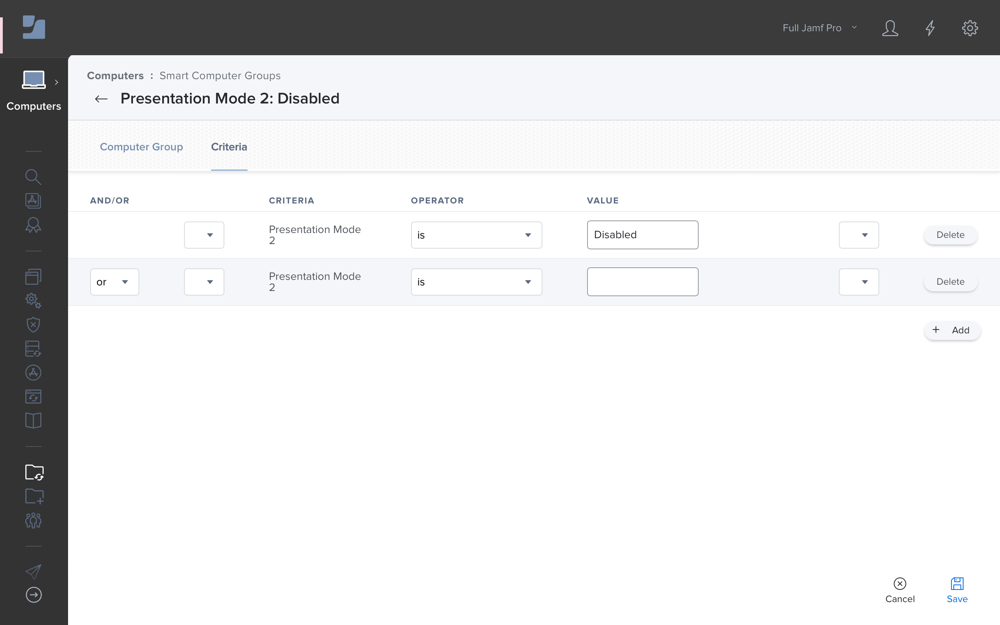

**Presentation Mode 2: Disabled**
- `Presentation Mode 2` `is` `Disabled`
- `or` `Presentation Mode 2` `is` `{blank}`

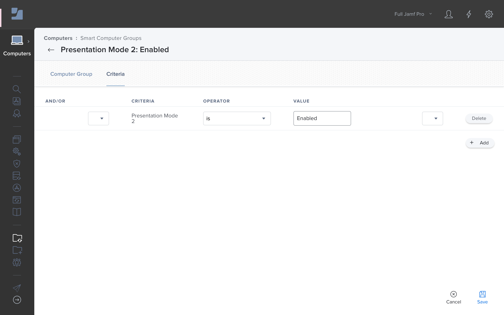

**Presentation Mode 2: Enabled**
- `Presentation Mode 2` `is` `Enabled`

---

## Configuration Profiles


**Security & Privacy**: Security-approved settings for screensaver password timeouts, computer sleep options, etc., scoped to **Presentation Mode 2: Disabled**.
- Restrictions
- Login Window
- Security and Privacy
- Energy Saver

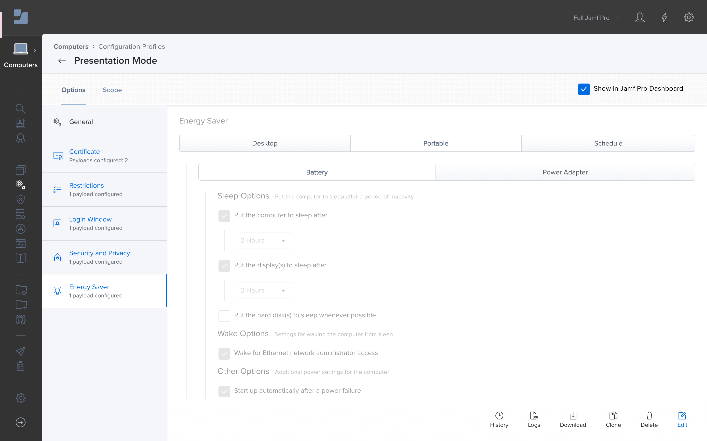

**Presentation Mode**: Security-approved _relaxed_ settings for screensaver password timeouts, computer sleep options, etc., scoped to **Presentation Mode 2: Enabled**. (Most frequently created from a clone of the Security & Privacy Configuration Profile.)
- Restrictions
- Login Window
- Security and Privacy
- Energy Saver

---

## Scripts

### Delayed Policy Trigger Create

Customize the `plistDomain` variable and add the following Parameter Labels to the [Delayed Policy Trigger Create.bash](images/Delayed%20Policy%20Trigger%20Create.bash) script:

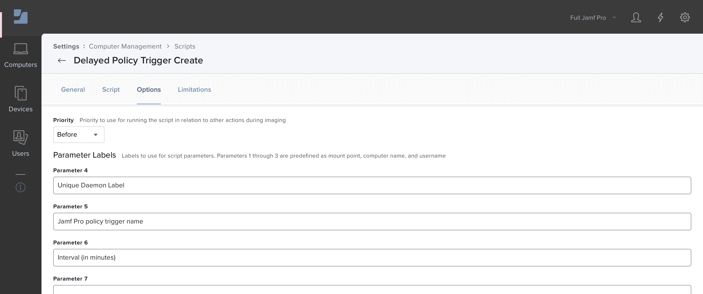

- Parameter 4: `Unique Daemon Label`
- Parameter 5: `Jamf Pro policy trigger name`
- Parameter 6: `Interval (in minutes)`

### Delayed Policy Trigger Disable

Customize the `plistDomain` variable and add the following Parameter Label to the [Delayed Policy Trigger Disable.bash](Delayed%20Policy%20Trigger%20Disable.bash) script:

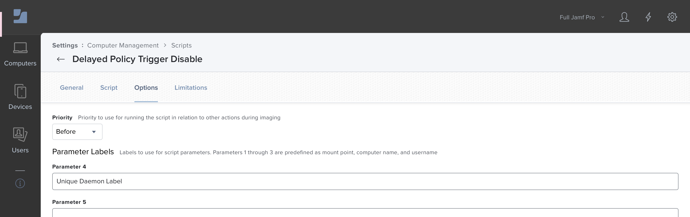

- Parameter 4: `Unique Daemon Label`

### Display Message: JAMF binary

Add the following Parameter Label to the [Display Message JAMF binary.bash](Display%20Message%20JAMF%20binary.sh) script:


- Parameter 4: `Text of end-user message`


### Extension Attribute Update

Generate [Encrypted Script Parameters](https://github.com/jamf/Encrypted-Script-Parameters) for the encrypted API account password and update the following variables in the [Extension Attribute Update.sh](Extension%20Attribute%20Update.sh) script:
- `apiURL`
- `Salt`
- `Passphrase`

I add the following snippet to the bottom of `EncryptedStrings_Bash.sh` so the values will be output to Terminal when called via: `./EncryptedStrings_Bash.sh 'Purple Monkey Dishwasher'`

```
# Output to Terminal
args=("$@")
password="${args[0]}"

GenerateEncryptedString "${password}"
```

Add the following Parameter Labels to the [Extension Attribute Update.sh](Extension%20Attribute%20Update.sh) script:


- Parameter 4: `API Username (Read / Write)`
- Parameter 5: `API Encrypted Password (Read / Write)`
- Parameter 6: `EA Name (i.e., "Presentation Mode 2")`
- Parameter 7: `EA Value (i.e., "Enabled" or "None")`

---

## Policies

### Policies Overview

The following provides an overview of both policies:

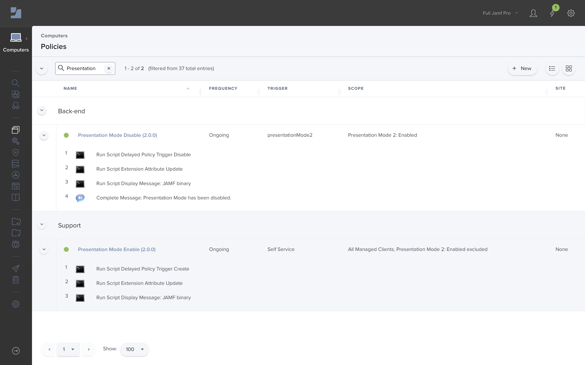

### Presentation Mode Enable

#### Options

- **General**
	- Display Name: `Presentation Mode Enable (2.0.0)`
	- Execution Frequency: `Ongoing`
	- Trigger: `Self Service`

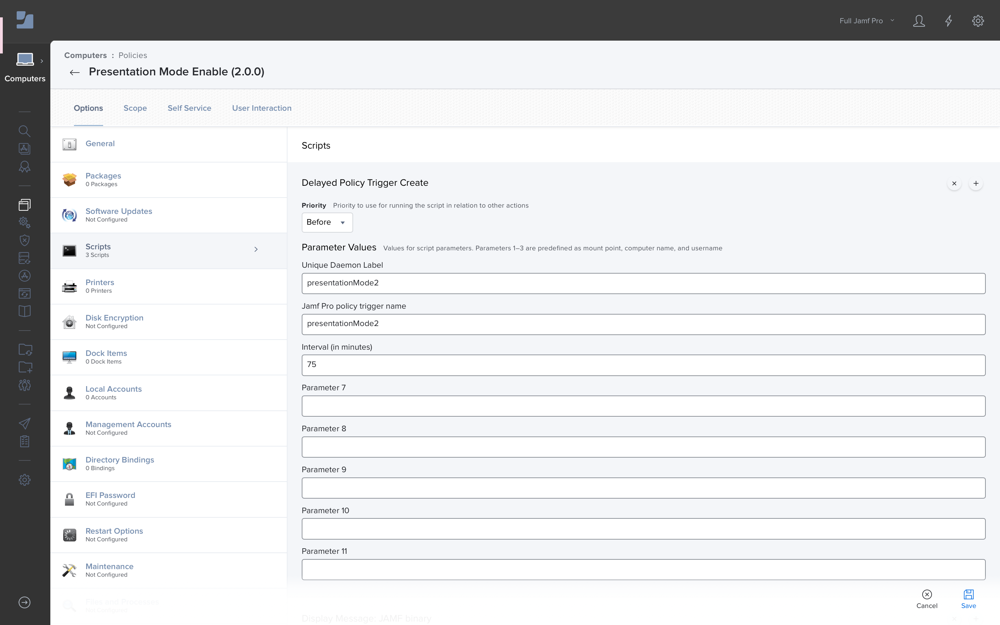
- **Scripts**
	- Delayed Policy Trigger Create
		- Unique Daemon Label: `presentationMode2`
		- Jamf Pro policy trigger name: `presentationMode2`
		- Interval (in minutes): `75`


- **Scripts**
	- Extension Attribute Update
		- API Username (Read / Write): `apiPresentationMode2`
		- API Encrypted Password (Read / Write): See [Encrypted Script Parameters](https://github.com/jamf/Encrypted-Script-Parameters)
		- EA Name (i.e., "Presentation Mode 2"): `Presentation Mode 2`
		- EA Value (i.e., "Enabled" or "None"): `Enabled`

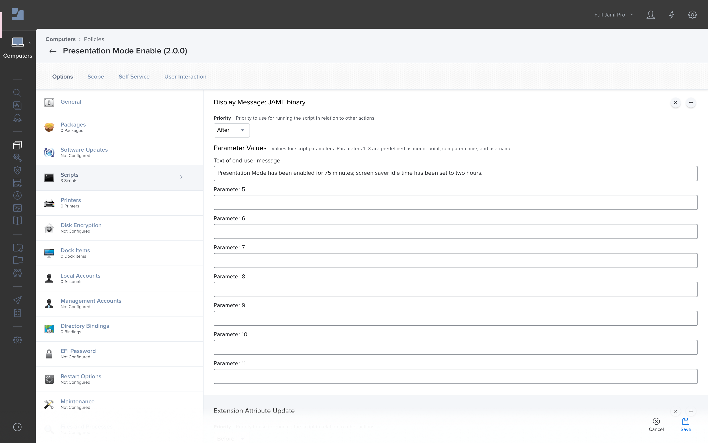
- **Scripts**
	- Display Message: JAMF binary
		- Text of end-user message: `Presentation Mode has been enabled for 75 minutes; screen saver idle time has been set to two hours.`

#### Scope
- Targets: `All Managed Clients`
- Limitations: `None`
- Exclusions: `Presentation Mode 2: Enabled`

#### Self Service

- Make the policy available in Self Service: `Enabled`
- Self Service Display Name: `Presentation Mode (2.0.0)`
- Description: `Click Enable to temporarily set the screensaver idle time to two hours. After 75 minutes, Presentation Mode will be automatically disabled and the screensaver settings will be restored to IT Security standards.`

---

### Presentation Mode Disable

#### Options
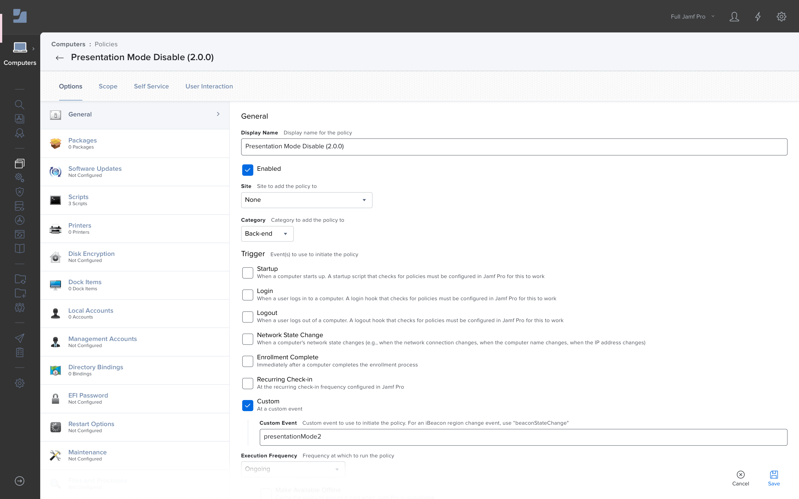
- **General**
	- Display Name: `Presentation Mode Disable (2.0.0)`
	- Trigger
		- Custom: `presentationMode2`
	- Execution Frequency: `Ongoing`


- **Scripts**
	- Delayed Policy Trigger Disable
		- Unique Daemon Label: `presentationMode2`


- **Scripts**
	- Extension Attribute Update
		- API Username (Read / Write): `apiPresentationMode2`
		- API Encrypted Password (Read / Write): See [Encrypted Script Parameters](https://github.com/jamf/Encrypted-Script-Parameters)
		- EA Name (i.e., "Presentation Mode 2"): `Presentation Mode 2`
		- EA Value (i.e., "Enabled" or "None"): `Disabled`


- **Scripts**
	- Display Message: JAMF binary
		- Text of end-user message: `Presentation Mode has ended. The screensaver timeout is again set to the IT standards. If additional time is required, please return to the Workforce App Store and re-enable Presentation Mode.`

#### Scope
- Targets: `Presentation Mode 2: Enabled`

#### User Interaction
- Complete Message: `Presentation Mode has been disabled.`

---

# Automatic Policy Execution Scope

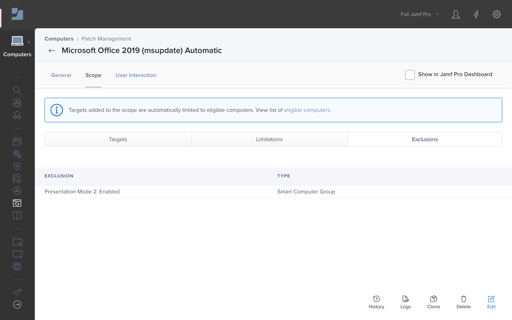

Add the `Presentation Mode 2: Enabled` Smart Group as an **Exclusion** for automatic Patch Policies and any Ongoing, Recurring Check-in Policies which could interrupt users' presentations (i.e., operating system update policies, etc.)

---

# End Notes
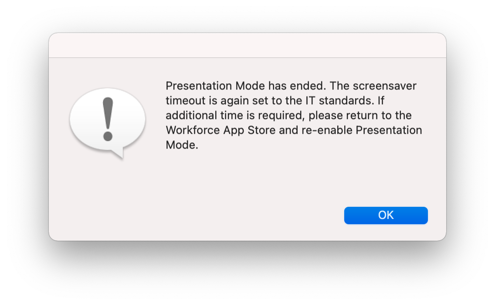

## Rehearsals
- [2020-09-19](https://snelson.us/presentationMode/rehearsals/rehearsal-2020-09-19.m4v)
- [2020-10-03](https://snelson.us/presentationMode/rehearsals/rehearsal-2020-10-03.m4v)
